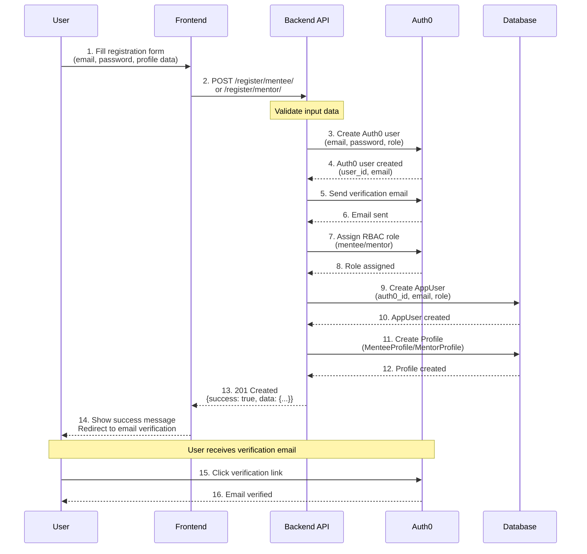
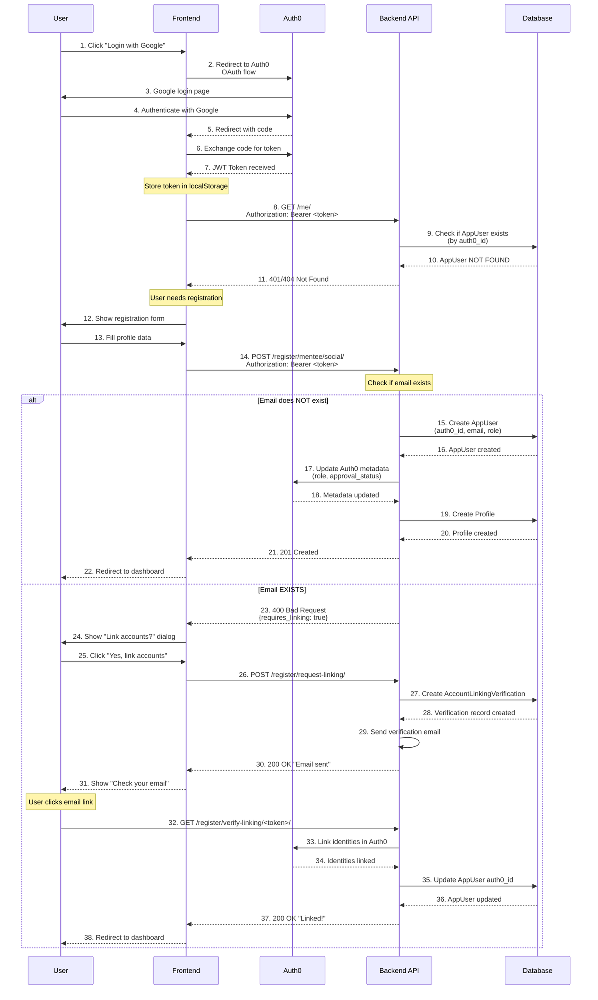
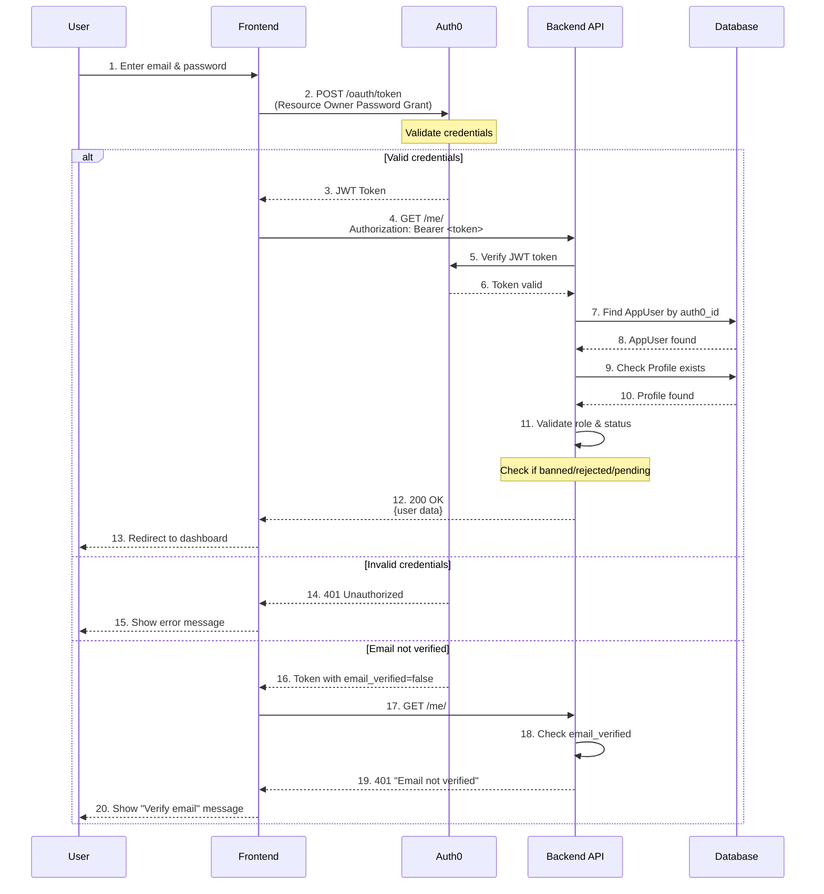
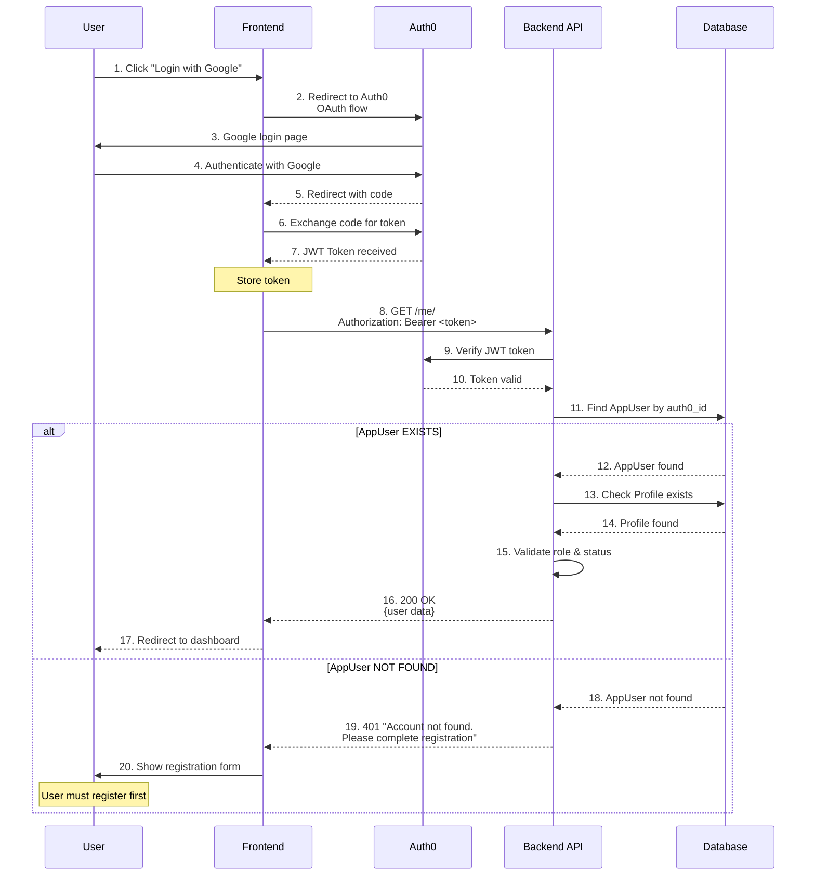
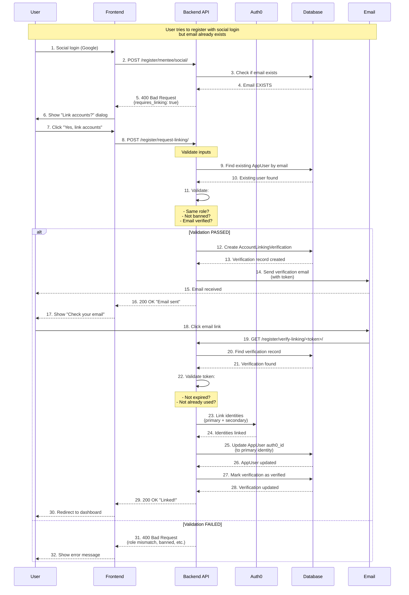
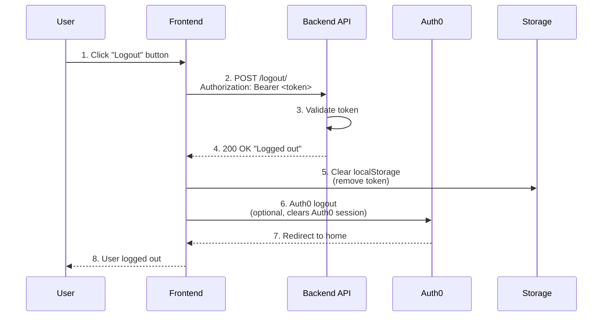
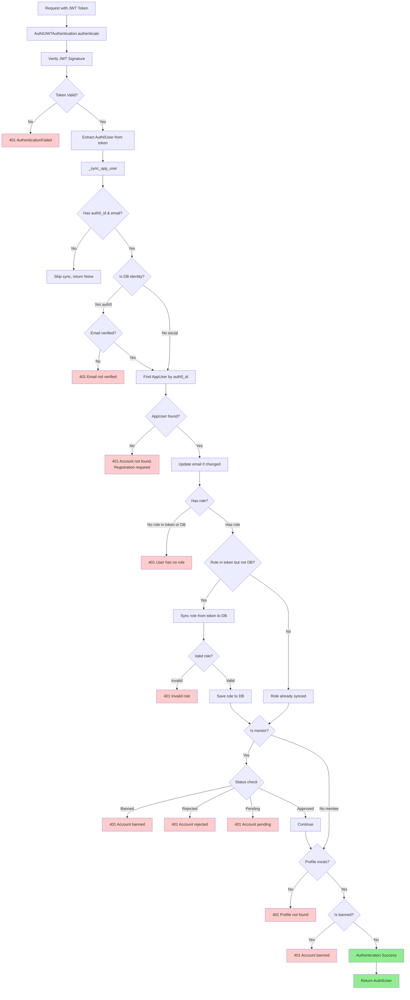
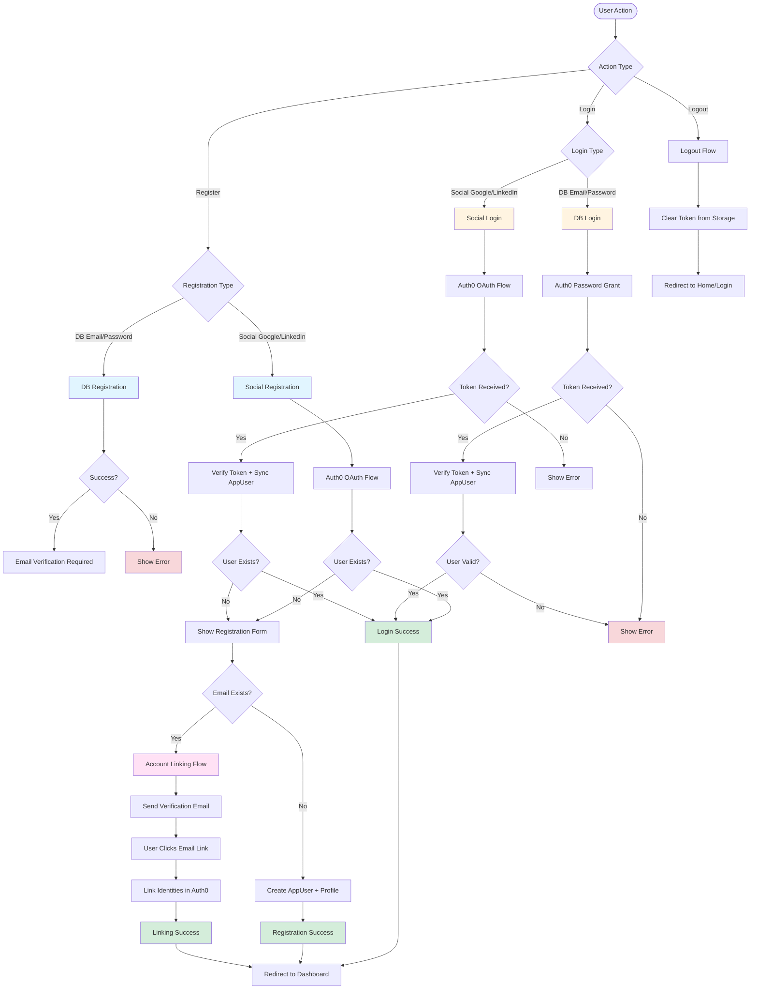

# Diagrammes de Flux d'Authentification

Ce document contient les diagrammes de flux complets pour tous les scénarios d'authentification du système LinkDeal.

---

## 📋 Table des Matières

1. [Vue d'Ensemble](#vue-densemble)
2. [Inscription avec Email/Password (DB)](#inscription-avec-emailpassword-db)
3. [Inscription Sociale (Google/LinkedIn)](#inscription-sociale-googlelinkedin)
4. [Login avec Email/Password (DB)](#login-avec-emailpassword-db)
5. [Login Social (Google/LinkedIn)](#login-social-googlelinkedin)
6. [Account Linking Flow](#account-linking-flow)
7. [Logout Flow](#logout-flow)
8. [Sync AppUser lors de l'Authentification](#sync-appuser-lors-de-lauthentification)

---

## 🎯 Vue d'Ensemble

```
┌─────────────────────────────────────────────────────────────────┐
│                    SYSTÈME D'AUTHENTIFICATION                    │
│                         LinkDeal Backend                         │
└─────────────────────────────────────────────────────────────────┘

┌──────────────┐         ┌──────────────┐         ┌──────────────┐
│   Frontend   │         │    Auth0     │         │   Backend    │
│              │         │              │         │   Django     │
└──────┬───────┘         └──────┬───────┘         └──────┬───────┘
       │                        │                        │
       │                        │                        │
       │  1. Registration       │                        │
       │     - DB (email/pwd)   │                        │
       │     - Social (OAuth)   │                        │
       │                        │                        │
       │  2. Login              │                        │
       │     - DB (email/pwd)   │                        │
       │     - Social (OAuth)   │                        │
       │                        │                        │
       │  3. Account Linking    │                        │
       │     (si email existe)  │                        │
       │                        │                        │
       │  4. Logout             │                        │
       │                        │                        │
```

---

## 📝 Inscription avec Email/Password (DB)

### Flow Diagram



### Détails du Processus

```
┌─────────────────────────────────────────────────────────────┐
│           INSCRIPTION DB (Email/Password)                     │
└─────────────────────────────────────────────────────────────┘

1. USER REMPLIT LE FORMULAIRE
   ├─ Email
   ├─ Password + Confirm
   ├─ Full Name
   ├─ Field of Study (mentee) / Bio (mentor)
   ├─ Country
   └─ Profile Picture (optionnel)

2. FRONTEND ENVOIE À BACKEND
   POST /api/auth/register/mentee/
   ou
   POST /api/auth/register/mentor/
   
   Body: FormData
   {
     email: "user@example.com",
     password: "SecurePass123!",
     password_confirm: "SecurePass123!",
     full_name: "John Doe",
     field_of_study: "Computer Science",  // mentee
     country: "Morocco",
     profile_picture: File (optional)
   }

3. BACKEND VALIDE LES DONNÉES
   ├─ Email format
   ├─ Password strength
   ├─ Passwords match
   └─ Required fields

4. BACKEND CRÉE USER DANS AUTH0
   Auth0Client.create_user()
   ├─ Email: user@example.com
   ├─ Password: SecurePass123!
   ├─ Role: "mentee" ou "mentor"
   └─ Approval Status: "approved" (mentee) / "pending" (mentor)
   
   Response: {
     user_id: "auth0|abc123",
     email: "user@example.com"
   }

5. BACKEND ENVOIE EMAIL DE VÉRIFICATION
   Auth0Client.send_verification_email()
   └─ Auth0 envoie email automatiquement

6. BACKEND ASSIGNE ROLE RBAC (si configuré)
   Auth0Client.assign_role()
   └─ Role ID: AUTH0_MENTEE_ROLE_ID ou AUTH0_MENTOR_ROLE_ID

7. BACKEND CRÉE APPUSER DANS DB
   AppUser.objects.create()
   ├─ auth0_id: "auth0|abc123"
   ├─ email: "user@example.com"
   ├─ role: "mentee" ou "mentor"
   └─ status: "active"

8. BACKEND CRÉE PROFILE DANS DB
   MenteeProfile.objects.create() ou MentorProfile.objects.create()
   ├─ user: AppUser
   ├─ full_name: "John Doe"
   ├─ email: "user@example.com"
   ├─ field_of_study: "Computer Science" (mentee)
   └─ country: "Morocco"

9. BACKEND RETOURNE SUCCÈS
   Response 201:
   {
     "success": true,
     "data": {
       "id": "uuid",
       "email": "user@example.com",
       "role": "mentee"
     }
   }

10. USER REÇOIT EMAIL DE VÉRIFICATION
    └─ Click sur lien → Email vérifié dans Auth0
```

---

## 🌐 Inscription Sociale (Google/LinkedIn)

### Flow Diagram



### Détails du Processus

```
┌─────────────────────────────────────────────────────────────┐
│           INSCRIPTION SOCIALE (Google/LinkedIn)              │
└─────────────────────────────────────────────────────────────┘

ÉTAPE 1: AUTHENTIFICATION AUTH0
────────────────────────────────
1. USER CLIQUE "LOGIN WITH GOOGLE"
   └─ Frontend appelle authService.login('google-oauth2')

2. REDIRECTION VERS AUTH0
   └─ window.location → https://tenant.auth0.com/authorize
      ├─ client_id: AUTH0_SPA_CLIENT_ID
      ├─ redirect_uri: http://localhost:3000/callback
      ├─ response_type: code
      ├─ scope: openid profile email
      └─ connection: google-oauth2

3. USER S'AUTHENTIFIE AVEC GOOGLE
   └─ Google OAuth flow

4. AUTH0 REDIRECTE VERS CALLBACK
   └─ http://localhost:3000/callback?code=xxx&state=yyy

5. FRONTEND ÉCHANGE CODE POUR TOKEN
   └─ POST https://tenant.auth0.com/oauth/token
      Response: {
        access_token: "eyJhbGc...",
        id_token: "eyJhbGc...",
        expires_in: 86400
      }

6. FRONTEND STOCKE LE TOKEN
   └─ localStorage.setItem('auth0_token', token)


ÉTAPE 2: VÉRIFICATION UTILISATEUR
──────────────────────────────────
7. FRONTEND APPELLE /me/
   GET /api/auth/me/
   Headers: Authorization: Bearer <token>

8. BACKEND VÉRIFIE LE TOKEN
   ├─ Auth0JWTAuthentication.authenticate()
   ├─ Verify JWT signature
   └─ Extract user info from token

9. BACKEND SYNC APPUSER
   ├─ IdentityMappingService.map_identity_to_app_user()
   └─ Check if AppUser exists by auth0_id

10. SI APPUSER N'EXISTE PAS
    └─ Response: 401 Unauthorized ou 404 Not Found
    └─ Frontend affiche formulaire d'inscription


ÉTAPE 3: INSCRIPTION
─────────────────────
11. USER REMPLIT FORMULAIRE
    ├─ Full Name
    ├─ Field of Study (mentee) / Bio (mentor)
    ├─ Country
    └─ Profile Picture (optional)

12. FRONTEND ENVOIE À BACKEND
    POST /api/auth/register/mentee/social/
    Headers: Authorization: Bearer <token>
    Body: FormData
    {
      full_name: "John Doe",
      field_of_study: "Computer Science",
      country: "Morocco",
      profile_picture: File (optional)
    }

13. BACKEND VÉRIFIE SI EMAIL EXISTE
    AppUser.objects.filter(email=email).first()

14. SI EMAIL N'EXISTE PAS
    ├─ Create AppUser
    ├─ Update Auth0 metadata
    ├─ Create Profile
    └─ Response: 201 Created

15. SI EMAIL EXISTE
    └─ Response: 400 Bad Request
       {
         "email": ["An account with this email already exists..."],
         "requires_linking": true
       }
    └─ Frontend affiche dialog "Link accounts?"
```

---

## 🔐 Login avec Email/Password (DB)

### Flow Diagram



### Détails du Processus

```
┌─────────────────────────────────────────────────────────────┐
│              LOGIN DB (Email/Password)                       │
└─────────────────────────────────────────────────────────────┘

1. USER ENTRE EMAIL ET PASSWORD
   └─ Frontend form

2. FRONTEND OBTIENT TOKEN D'AUTH0
   POST https://tenant.auth0.com/oauth/token
   {
     grant_type: "password",
     client_id: AUTH0_SPA_CLIENT_ID,
     client_secret: AUTH0_SPA_CLIENT_SECRET,
     username: "user@example.com",
     password: "SecurePass123!",
     audience: AUTH0_AUDIENCE,
     scope: "openid profile email"
   }

3. AUTH0 VALIDE CREDENTIALS
   ├─ Check email exists
   ├─ Verify password
   └─ Check email_verified

4. SI CREDENTIALS VALIDES
   └─ Response: {
        access_token: "eyJhbGc...",
        id_token: "eyJhbGc...",
        expires_in: 86400
      }

5. FRONTEND STOCKE LE TOKEN
   └─ localStorage.setItem('auth0_token', token)

6. FRONTEND APPELLE /me/
   GET /api/auth/me/
   Headers: Authorization: Bearer <token>

7. BACKEND AUTHENTIFIE LE TOKEN
   ├─ Auth0JWTAuthentication.authenticate()
   ├─ Verify JWT signature with Auth0 public key
   └─ Extract user info

8. BACKEND SYNC APPUSER
   ├─ _sync_app_user()
   ├─ Find AppUser by auth0_id
   ├─ Check if AppUser exists
   └─ If not found → 401 "Account not found"

9. BACKEND VALIDE ROLE
   ├─ Check if user has role (token or DB)
   ├─ If no role → 401 "User account has no role"
   └─ Sync role from token to DB if needed

10. BACKEND VALIDE STATUS
    ├─ If mentor: Check status (banned/rejected/pending)
    ├─ If mentee: Check status (banned)
    └─ If invalid → 401 "Account is banned/pending"

11. BACKEND VALIDE PROFILE
    ├─ Check if MentorProfile/MenteeProfile exists
    └─ If not found → 401 "Profile not found"

12. BACKEND RETOURNE USER DATA
    Response 200:
    {
      "id": "uuid",
      "email": "user@example.com",
      "role": "mentee",
      "auth0_id": "auth0|abc123",
      "app_metadata": {...},
      "permissions": [...]
    }

13. FRONTEND REDIRECTE VERS DASHBOARD
    └─ User is logged in
```

---

## 🌐 Login Social (Google/LinkedIn)

### Flow Diagram



### Détails du Processus

```
┌─────────────────────────────────────────────────────────────┐
│              LOGIN SOCIAL (Google/LinkedIn)                   │
└─────────────────────────────────────────────────────────────┘

1. USER CLIQUE "LOGIN WITH GOOGLE"
   └─ Frontend appelle authService.login('google-oauth2')

2. REDIRECTION VERS AUTH0
   └─ OAuth flow (même que registration sociale)

3. USER S'AUTHENTIFIE AVEC GOOGLE
   └─ Google OAuth

4. AUTH0 RETOURNE TOKEN
   └─ JWT token avec:
      ├─ sub: "google-oauth2|123456"
      ├─ email: "user@gmail.com"
      ├─ email_verified: true
      └─ role: (si assigné)

5. FRONTEND APPELLE /me/
   GET /api/auth/me/
   Headers: Authorization: Bearer <token>

6. BACKEND AUTHENTIFIE LE TOKEN
   ├─ Verify JWT signature
   └─ Extract user info

7. BACKEND SYNC APPUSER
   ├─ _sync_app_user()
   ├─ IdentityMappingService.map_identity_to_app_user()
   └─ Find AppUser by auth0_id

8. SI APPUSER EXISTE
   ├─ Check Profile exists
   ├─ Validate role & status
   └─ Response: 200 OK {user data}
   └─ Frontend redirecte vers dashboard

9. SI APPUSER N'EXISTE PAS
   └─ Response: 401 "Account not found. Please complete registration first."
   └─ Frontend affiche formulaire d'inscription
   └─ IMPORTANT: Pas d'auto-création!
```

---

## 🔗 Account Linking Flow

### Flow Diagram



### Détails du Processus

```
┌─────────────────────────────────────────────────────────────┐
│                    ACCOUNT LINKING FLOW                      │
└─────────────────────────────────────────────────────────────┘

SCÉNARIO: User a un compte DB (email/password) et veut lier
          son compte Google/LinkedIn

ÉTAPE 1: DÉTECTION DU CONFLIT
─────────────────────────────
1. USER S'INSCRIT AVEC GOOGLE
   └─ Email: user@example.com

2. BACKEND DÉTECTE EMAIL EXISTANT
   POST /api/auth/register/mentee/social/
   └─ AppUser.objects.filter(email=email).first()
   └─ Email trouvé!

3. BACKEND RETOURNE ERREUR
   Response 400:
   {
     "email": ["An account with this email already exists..."],
     "requires_linking": true
   }

4. FRONTEND AFFICHE DIALOG
   └─ "An account with this email already exists.
       Would you like to link your social account?"


ÉTAPE 2: DEMANDE DE LINKING
────────────────────────────
5. USER CLIQUE "YES, LINK ACCOUNTS"
   └─ Frontend appelle /register/request-linking/

6. BACKEND VALIDE LA DEMANDE
   POST /api/auth/register/request-linking/
   Body: {
     email: "user@example.com",
     link_consent: true,
     registration_data: {...},
     role: "mentee"
   }

7. BACKEND VÉRIFIE LES CONDITIONS
   ├─ Find existing AppUser by email
   ├─ Check if same role
   ├─ Check if not banned
   ├─ Check if email verified (for DB accounts)
   └─ Check if not already linked

8. SI VALIDATION PASSÉE
   ├─ Create AccountLinkingVerification record
   ├─ Generate secure token
   ├─ Set expires_at (15 minutes)
   └─ Send verification email

9. EMAIL DE VÉRIFICATION ENVOYÉ
   └─ Link: http://frontend.com/verify-linking/<token>/


ÉTAPE 3: VÉRIFICATION ET LINKING
─────────────────────────────────
10. USER CLIQUE LE LIEN DANS L'EMAIL
    └─ GET /api/auth/register/verify-linking/<token>/

11. BACKEND VALIDE LE TOKEN
    ├─ Find AccountLinkingVerification by token
    ├─ Check if not expired
    ├─ Check if not already verified
    └─ Check if not expired

12. BACKEND LIE LES IDENTITÉS DANS AUTH0
    Auth0Client.link_identities()
    ├─ Primary identity: existing auth0_id (DB)
    └─ Secondary identity: new auth0_id (Google)
    
    Result: Both identities linked to primary

13. BACKEND MET À JOUR APPUSER
    ├─ Update auth0_id to primary identity
    └─ Update email if changed

14. BACKEND MARQUE LA VÉRIFICATION
    └─ verification.verified = True

15. BACKEND RETOURNE SUCCÈS
    Response 200:
    {
      "success": true,
      "message": "Accounts linked successfully!",
      "user": {...}
    }

16. USER PEUT MAINTENANT SE CONNECTER
    └─ Avec email/password OU Google/LinkedIn
    └─ Même compte, même profil
```

---

## 🚪 Logout Flow

### Flow Diagram



### Détails du Processus

```
┌─────────────────────────────────────────────────────────────┐
│                       LOGOUT FLOW                           │
└─────────────────────────────────────────────────────────────┘

1. USER CLIQUE "LOGOUT"
   └─ Frontend button

2. FRONTEND APPELLE BACKEND (optionnel)
   POST /api/auth/logout/
   Headers: Authorization: Bearer <token>
   
   Response 200:
   {
     "success": true,
     "message": "Logged out successfully"
   }

3. FRONTEND NETTOIE LE STORAGE
   ├─ localStorage.removeItem('auth0_token')
   ├─ Clear any user state
   └─ Clear any cached data

4. FRONTEND LOGOUT AUTH0 (optionnel)
   authService.logout()
   └─ Clears Auth0 session
   └─ Redirects to home page

5. USER EST DÉCONNECTÉ
   └─ Redirect to login page or home
```

---

## 🔄 Sync AppUser lors de l'Authentification

### Flow Diagram



### Détails du Processus de Sync

```
┌─────────────────────────────────────────────────────────────┐
│         SYNC APPUSER LORS DE L'AUTHENTIFICATION              │
└─────────────────────────────────────────────────────────────┘

1. TOKEN REÇU
   └─ Authorization: Bearer <JWT_TOKEN>

2. VÉRIFICATION DU TOKEN
   ├─ Verify JWT signature with Auth0 public key
   ├─ Check expiration
   └─ Extract payload

3. CRÉATION AUTH0USER
   └─ Auth0User(payload)
      ├─ auth0_id: "google-oauth2|123456"
      ├─ email: "user@gmail.com"
      ├─ email_verified: true
      ├─ role: "mentee" (if in token)
      └─ roles: ["mentee"] (if in token)

4. SYNC APPUSER
   └─ _sync_app_user(auth0_user)

5. VALIDATIONS INITIALES
   ├─ Check auth0_id exists → Skip if missing
   ├─ Check email exists → Skip if missing
   └─ Check if DB identity → Require email_verified

6. RECHERCHE APPUSER
   └─ IdentityMappingService.map_identity_to_app_user()
      ├─ Find AppUser by auth0_id (exact match)
      └─ If not found → ValueError → 401 "Account not found"

7. MISE À JOUR EMAIL (si changé)
   └─ If app_user.email != auth0_user.email
      └─ Update app_user.email

8. VALIDATION ROLE
   ├─ Check if user has role (token or DB)
   ├─ If no role → 401 "User has no role"
   └─ If token has role but DB doesn't → Sync from token

9. SYNC ROLE (si nécessaire)
   ├─ Extract role from token (priority: super_admin > admin > mentor > mentee)
   ├─ Validate role is in allowed choices
   └─ Save to DB

10. VALIDATION STATUS (Mentor)
    ├─ Check MentorProfile exists
    ├─ Check status: banned → 401 "Account banned"
    ├─ Check status: rejected → 401 "Account rejected"
    └─ Check status: pending → 401 "Account pending"

11. VALIDATION STATUS (Mentee)
    ├─ Check MenteeProfile exists
    └─ Check status: banned → 401 "Account banned"

12. SUCCÈS
    └─ Return Auth0User instance
    └─ request.user = Auth0User
    └─ View can access user data
```

---

## 📊 Vue d'Ensemble Complète



---

## 🔑 Points Clés

### Règles Importantes

1. **Pas d'auto-création** : L'inscription est obligatoire avant le login
2. **Email verification** : Requis pour les comptes DB (email/password)
3. **Role validation** : L'utilisateur doit avoir un rôle valide pour se connecter
4. **Status validation** : Les mentors doivent être approuvés, les comptes bannis sont bloqués
5. **Profile requirement** : Le profil (MenteeProfile/MentorProfile) doit exister
6. **Account linking** : Si l'email existe, proposer le linking au lieu de créer un nouveau compte

### Endpoints Principaux

| Endpoint | Method | Auth Required | Description |
|----------|--------|---------------|-------------|
| `/register/mentee/` | POST | No | Inscription mentee DB |
| `/register/mentor/` | POST | No | Inscription mentor DB |
| `/register/mentee/social/` | POST | Yes (JWT) | Inscription mentee social |
| `/register/mentor/social/` | POST | Yes (JWT) | Inscription mentor social |
| `/register/check-email/` | POST | Yes (JWT) | Vérifier si email existe |
| `/register/request-linking/` | POST | Yes (JWT) | Demander account linking |
| `/register/verify-linking/<token>/` | GET | No | Vérifier et lier les comptes |
| `/me/` | GET | Yes (JWT) | Obtenir info utilisateur actuel |
| `/logout/` | POST | Yes (JWT) | Déconnexion |

---

**Note** : Ces diagrammes représentent le flux complet d'authentification. Adaptez-les selon vos besoins spécifiques.

